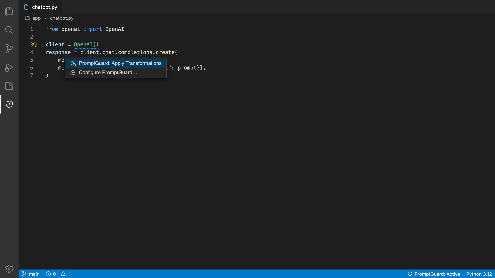
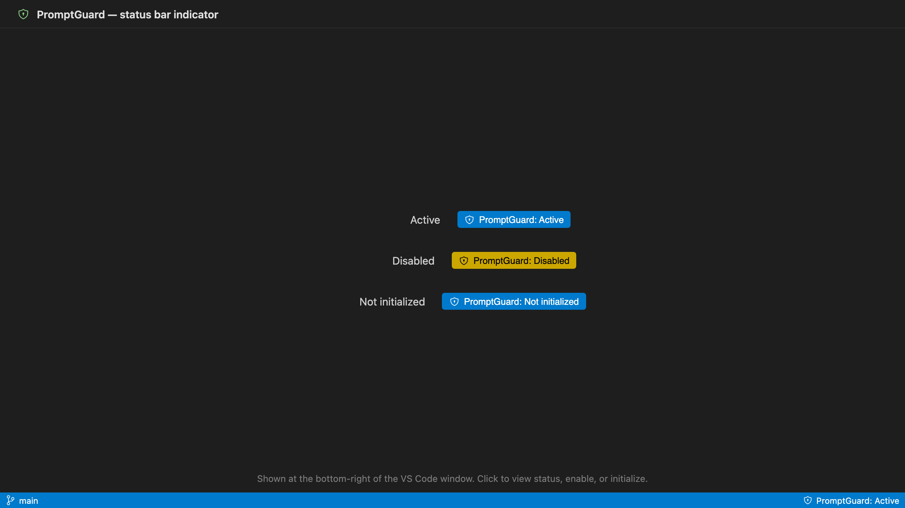
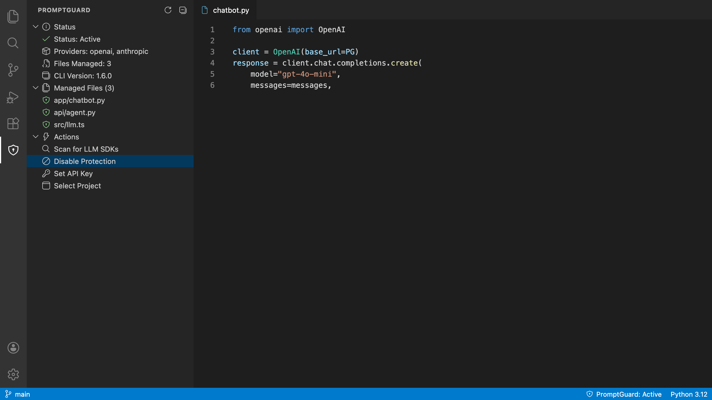

[](https://github.com/acebot712/promptguard-vscode/actions/workflows/ci.yml)
[](https://github.com/acebot712/promptguard-vscode/blob/main/LICENSE)

# PromptGuard VS Code Extension

Scan, detect, and secure LLM SDK usage in your codebase - directly in VS Code.

## Features

- **LLM SDK Detection**: Automatically detects OpenAI, Anthropic, Cohere, HuggingFace, Gemini, Groq, and AWS Bedrock SDKs in your code
- **Status Indicator**: See PromptGuard status at a glance in the status bar
- **One-Click Setup**: Initialize PromptGuard with a single command
- **Real-time Diagnostics**: Get warnings when LLM SDKs are detected without PromptGuard protection
- **Security Scanning**: Scan selected text or files for prompt injection and PII
- **PII Redaction**: Redact sensitive data from selected text
- **CLI Integration**: Seamlessly wraps the PromptGuard CLI

> **Tip:** For new projects, the [PromptGuard SDK](https://docs.promptguard.co/sdks/python) with auto-instrumentation (`promptguard.init()`) is the recommended integration - one line of code secures all LLM calls. The CLI and this extension are best for scanning existing codebases and applying proxy-mode transforms. (Python: install `promptguard-sdk`, import as `promptguard`.)

## Screenshots


_Inline diagnostic squiggle on an unprotected LLM SDK call, with the PromptGuard quick-fix._


_Status bar indicator showing Active / Disabled / Not initialized states._


_PromptGuard Activity Bar view: status, managed files, and quick actions._

## Requirements

- VS Code 1.80.0 or higher
- PromptGuard CLI installed (see [Installation](#installation))

## Installation

### 1. Install the PromptGuard CLI

```bash
curl -fsSL https://raw.githubusercontent.com/acebot712/promptguard-cli/main/install.sh | sh
```

Or install manually from [GitHub Releases](https://github.com/acebot712/promptguard-cli/releases).

### 2. Install the Extension

1. Open VS Code
2. Go to Extensions (Cmd+Shift+X / Ctrl+Shift+X)
3. Search for "PromptGuard"
4. Click Install

Or install from the command line:

```bash
code --install-extension promptguard.promptguard-vscode
```

## Usage

### Initialize PromptGuard

1. Open Command Palette (Cmd+Shift+P / Ctrl+Shift+P)
2. Run `PromptGuard: Initialize`
3. Enter your API key when prompted
4. Select providers (or press Escape to use all)

### Scan for LLM SDKs

1. Run `PromptGuard: Scan for LLM SDKs` from Command Palette
2. View results in the Output channel

### Check Status

- Click the status bar indicator (bottom right)
- Or run `PromptGuard: Show Status` from Command Palette

### Apply Transformations

1. Run `PromptGuard: Apply Transformations` from Command Palette
2. Confirm the action
3. Your code will be automatically transformed to use PromptGuard

## Configuration

### CLI Path

If the CLI is not in your PATH, you can set a custom path:

1. Open Settings (Cmd+, / Ctrl+,)
2. Search for "PromptGuard"
3. Set `PromptGuard: Cli Path` to the full path to the binary

Example: `/usr/local/bin/promptguard` or `C:\Program Files\PromptGuard\promptguard.exe`

### Settings

| Setting | Default | Description |
|---------|---------|-------------|
| `promptguard.cliPath` | `""` | Path to the CLI binary. Leave empty to auto-detect from PATH. |
| `promptguard.scanOnSave` | `true` | Re-scan the workspace for LLM SDK usage when a supported file is saved. Disable if scanning is slow on large workspaces. |
| `promptguard.autoInstallCli` | `"prompt"` | Behavior when the CLI is not found: `prompt` (ask), `never` (do nothing), or `auto` (install silently). |

## Commands

- `PromptGuard: Initialize` - Set up PromptGuard in your project
- `PromptGuard: Scan for LLM SDKs` - Scan project for LLM SDK usage
- `PromptGuard: Show Status` - Display current configuration
- `PromptGuard: Apply Transformations` - Apply PromptGuard transformations
- `PromptGuard: Disable` - Temporarily disable PromptGuard
- `PromptGuard: Enable` - Re-enable PromptGuard
- `PromptGuard: Set API Key` - Store your PromptGuard API key securely
- `PromptGuard: Select Project` - Switch the active PromptGuard project
- `PromptGuard: Scan Selection for Threats` - Scan the selected text for prompt injection and PII
- `PromptGuard: Redact PII from Selection` - Redact sensitive data from the selected text
- `PromptGuard: Scan File for Threats` - Scan an entire file for security threats
- `PromptGuard: Install/Update CLI` - Install or update the PromptGuard CLI

Right-click in the editor to Scan/Redact a selection; right-click a file in the Explorer to scan it.

## Status Bar

The status bar shows:
- **Active** - PromptGuard is active and protecting your app
- **Disabled** - PromptGuard is temporarily disabled
- **Not initialized** - PromptGuard hasn't been set up yet

Click the status bar to view detailed status.

## Sidebar

Open the shield icon in the Activity Bar for the PromptGuard view. It shows current status, managed files, and an **Actions** group with quick buttons to Initialize / Scan / Enable / Disable, plus **Set API Key** and **Select Project** so you can configure a key or switch projects without opening the Command Palette. Use the refresh icon in the view title bar to update both the tree and the status bar.

## Supported Languages

- TypeScript (`.ts`, `.tsx`)
- JavaScript (`.js`, `.jsx`)
- Python (`.py`)

## Supported Providers

- OpenAI
- Anthropic
- Cohere
- HuggingFace
- Gemini (Google)
- Groq
- AWS Bedrock

## Troubleshooting

### CLI Not Found

If you see "CLI not found" errors:

1. Verify the CLI is installed: `promptguard --version`
2. Check it's in your PATH: `which promptguard` (macOS/Linux) or `where promptguard` (Windows)
3. Set the `promptguard.cliPath` setting to the full path

### Extension Not Working

1. Check the Output channel: View → Output → Select "PromptGuard"
2. Reload the window: Cmd+Shift+P → "Developer: Reload Window"
3. Check VS Code version: Must be 1.80.0 or higher

## Links

- [PromptGuard Website](https://promptguard.co)
- [Documentation](https://docs.promptguard.co)
- [CLI Repository](https://github.com/acebot712/promptguard-cli)
- [Report Issues](https://github.com/acebot712/promptguard-vscode/issues)

## License

Apache 2.0

